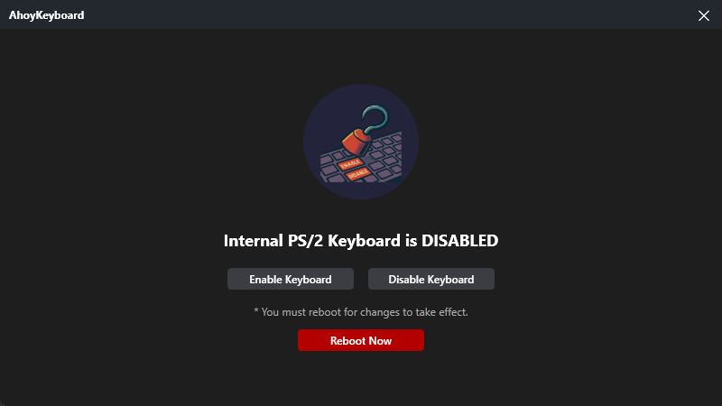

<p align="center">
  
</p>

# AhoyKeyboard (Built-in Keyboard Enable/Disable Tool)

## 🛠️ Overview

AhoyKeyboard is a lightweight WPF application that helps you easily enable or disable the built-in keyboard (especially on laptops) on Windows operating systems. It is useful when you want to prevent malfunction or unnecessary input from the built-in keyboard while using an external keyboard. This application is based on the .NET 9.0 framework and can be conveniently controlled from the system tray icon in the background.

## 🖼️ Screenshot

<p align="center">
  
</p>

## ✨ Main Features

- **Enable/Disable Built-in Keyboard:** Instantly turn your laptop's built-in keyboard on or off with a single click.
- **System Tray Icon:** The application runs in the background and is accessible via a system tray icon for better accessibility.
- **Easy Status Check:** Intuitively check the current keyboard status (enabled/disabled) through the tray icon.
- **Background Operation:** Minimizes to the tray to use minimal system resources.
- **Auto Start (Optional):** Optionally set the application to run automatically at Windows startup. (To be implemented)

## 🚀 Getting Started

### Prerequisites

- Windows 10 or later
- .NET 9.0 Runtime (If not installed, the application will guide you to download and install it.)
- Administrator privileges (Required to control device drivers)

### Installation (Release Version)

1. Download the latest `AhoyKeyboard.zip` file from the [Releases page](https://github.com/seobaeksol/AhoyKeyboard/releases). (Coming soon)
2. Extract the downloaded ZIP file.
3. Run the `AhoyKeyboard.exe` file inside the extracted folder.
   - **Note:** You must run as **Administrator** to control device drivers. Right-click the `AhoyKeyboard.exe` file and select "Run as administrator".

### Building (Development Environment)

To build from source, follow these steps:

1. **Install Visual Studio 2022 or later:** Include the .NET 9.0 development workload.
2. **Clone the repository:**
   ```bash
   git clone https://github.com/seobaeksol/AhoyKeyboard.git
   cd AhoyKeyboard
   ```
3. **Open the project:** Open the `AhoyKeyboard.sln` file in Visual Studio.
4. **Build:** Press `Ctrl + Shift + B` in Visual Studio, or select `Build > Build Solution` from the menu.
5. **Run:** The built executable will be generated in the `bin/Debug/net9.0-windows/` or `bin/Release/net9.0-windows/` folder. Run the `KeyboardToggle.exe` file **as administrator**.

## 💡 Usage

1. **Run the application:** Launch `AhoyKeyboard.exe` as administrator. The main window will appear or minimize directly to the system tray.
2. **System Tray Icon:** The Keyboard Toggle icon will appear in the system tray at the bottom right of the screen.
   - **Icon Click:** Toggles the built-in keyboard status. (e.g., green for enabled, gray for disabled)
   - **Right-click Icon:** Opens a context menu with the following options:
     - **Enable/Disable:** Toggle the keyboard status.
     - **Settings:** (To be implemented) Opens a window to change additional settings such as auto start.
     - **Exit:** Completely exits the application.
3. **Main Window Control:** You can also check and control the keyboard status from the main window.

## ⚙️ Tech Stack

- **Framework:** .NET 9.0
- **UI:** WPF (Windows Presentation Foundation)
- **Tray Icon:** [H.NotifyIcon.Wpf](https://github.com/HavenDV/H.NotifyIcon) (Used for system tray icon and context menu handling)
- **Device Control:** Direct device driver control via Windows API P/Invoke (`setupapi.dll`, `cfgmgr32.dll`, etc.)

## 🤝 Contributing

If you find bugs or want to suggest new features, please register them at [GitHub Issues](https://github.com/seobaeksol/AhoyKeyboard/issues) at any time. Pull requests are also welcome!

1. Fork the repository.
2. Create a new feature branch (`git checkout -b feature/AmazingFeature`).
3. Commit your changes (`git commit -m 'Add some AmazingFeature'`).
4. Push to the branch (`git push origin feature/AmazingFeature`).
5. Open a pull request.

## 📜 License

This project is distributed under the MIT License. For more details, see the [LICENSE](https://github.com/seobaeksol/AhoyKeyboard/license.md) file.

---

**Seobaeksol**
© 2025

---
